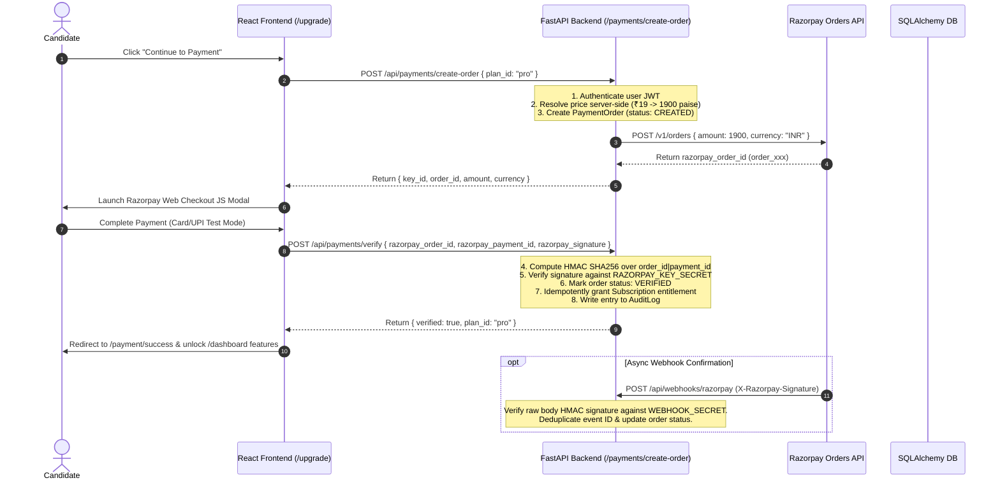

# System Architecture: AI Interviewer — AI-Powered Career Intelligence & Agentic Commerce Platform

## 1. System Overview

```
Candidate / User
        │
        ▼
React 18 + Vite Frontend (AppShell, Pricing, Upgrade, Dashboard, Billing)
        │
        ├── JWT Access Token (Memory) + httpOnly Refresh Cookie
        ▼
FastAPI Backend (Port 8000)
        │
        ├── Auth Module (JWT HS256, bcrypt)
        ├── Interview Manager & ATS Checker
        ├── Coding Evaluator (Piston API + Subprocess Fallback)
        ├── AI Career Intelligence Agent (Signal Aggregator & Readiness Scorer)
        ├── Centralized Server-Side Plan Catalog (Free, Pro, Advanced)
        ├── Razorpay Payment Service (Orders API, HMAC SHA256 Signature Verification)
        ├── Entitlement Service (Access Control & Subscription Management)
        └── Audit Service (Traceability & Security Logs)
                │
                ├── Razorpay Orders & Webhook Services
                │
                ▼
        SQLite / PostgreSQL Database
          (users, sessions, payment_orders, payments, subscriptions, 
           webhook_events, ai_career_recommendations, audit_logs)
```

---

## 2. Payment Lifecycle & Security Architecture



---

## 3. Security & Compliance Principles

1. **Server-Side Price Authority**: The frontend can send `plan_id="pro"`, but the backend resolves the authoritative price (`1900` paise). Frontend amounts are never trusted.
2. **HMAC SHA256 Verification**: Payment authorization requires server-side HMAC SHA256 calculation over `razorpay_order_id|razorpay_payment_id`.
3. **Idempotency**: Signature verification and webhook handling deduplicate requests using server order IDs and `WebhookEvent` records (`external_event_id`).
4. **Secret Isolation**: `RAZORPAY_KEY_SECRET` and `RAZORPAY_WEBHOOK_SECRET` reside exclusively on the server and are never exposed to client JavaScript.
5. **Agentic Commerce Guardrail**: AI recommends plans based on candidate performance signals, but **never** initiates financial transactions without explicit user click and authorization.
